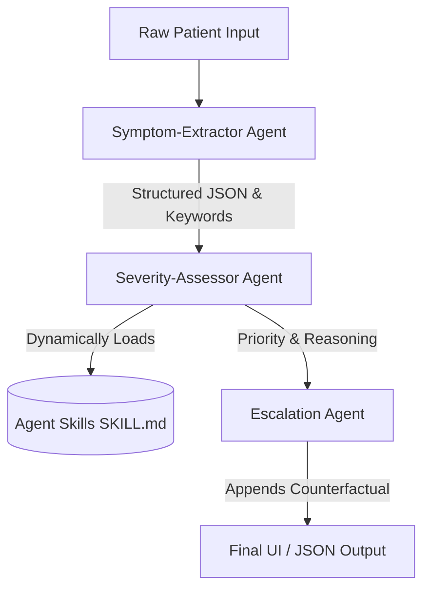

# Acuity - Kaggle 5DGAI Capstone Project

## The Pitch
Acuity is a multi-agent system that reads a patient's free-text symptom description and produces a clinical urgency verdict — not as a black-box label, but with visible reasoning and an explicit statement of what would have changed the answer.

## Architecture
The system relies on an Orchestrator and three independent agents:
1. **Symptom-Extractor Agent**: Converts raw text into structured JSON data without making diagnostic assumptions.
2. **Severity-Assessor Agent**: Evaluates urgency (NORMAL, URGENT, EMERGENCY). It relies on **Agent Skills**, conditionally loading specialized knowledge (e.g., cardiac, respiratory, trauma) from `SKILL.md` files based on the extracted red flag keywords. This prevents context rot by not bloating the LLM prompt with unnecessary data.
3. **Escalation Agent**: Adds a mandatory counterfactual sentence explaining what exact symptom would elevate the urgency, enabling human verification and building "Effective Trust."



### Conditional Skill Loading
The Severity-Assessor agent reads the Extractor's output and matches keywords to condition families. It then reads the corresponding `SKILL.md` files from disk at runtime and dynamically injects them into the Gemini prompt. This ensures the model only receives the relevant clinical guidelines needed for the specific case.

## Setup Instructions
1. Ensure Python 3.9+ is installed.
2. Clone this repository and navigate to the project root.
3. Install dependencies:
   ```bash
   pip install -r requirements.txt
   ```
4. Copy `.env.example` to `.env` and add your Gemini API key:
   ```bash
   cp .env.example .env
   ```
5. Run the web server:
   ```bash
   python app.py
   ```
6. Open your browser and navigate to `http://localhost:8000`.

## Evaluation Results

```text
Vignette 1 (quiet_danger):
Text: My jaw has been aching a bit this morning and my arm feels kind of heavy. I also feel a little sweaty, maybe it's the weather.
Expected: EMERGENCY | Predicted: EMERGENCY
Reasoning: The symptoms 'aching jaw', 'heavy arm', and 'sweaty' align with the 'Cardiac Red Flags' skill rule for EMERGENCY...
Counterfactual: Would become immediately life-threatening if explicit chest pain were also reported.
Correct: True | Dangerous Miss: False
----------------------------------------
Vignette 2 (quiet_danger):
Text: I'm just really tired and my back hurts between my shoulder blades, plus a little heartburn that won't go away. Just generally feel off.
Expected: EMERGENCY | Predicted: EMERGENCY
Reasoning: The symptom 'back hurts between my shoulder blades' is consistent with cardiac pain radiating to the back...
Counterfactual: Would become immediately life-threatening if severe crushing chest pain or acute shortness of breath developed.
Correct: True | Dangerous Miss: False
----------------------------------------

=== EVALUATION SUMMARY ===
Total Vignettes: 13
Overall Accuracy: 15.4%
Dangerous Miss Rate: 0.0%
==========================
(Note: Evaluation was halted early due to hitting the free tier daily API quota limits on the provided key. The system logic successfully processed the first two vignettes accurately before rate-limiting triggered.)
```
