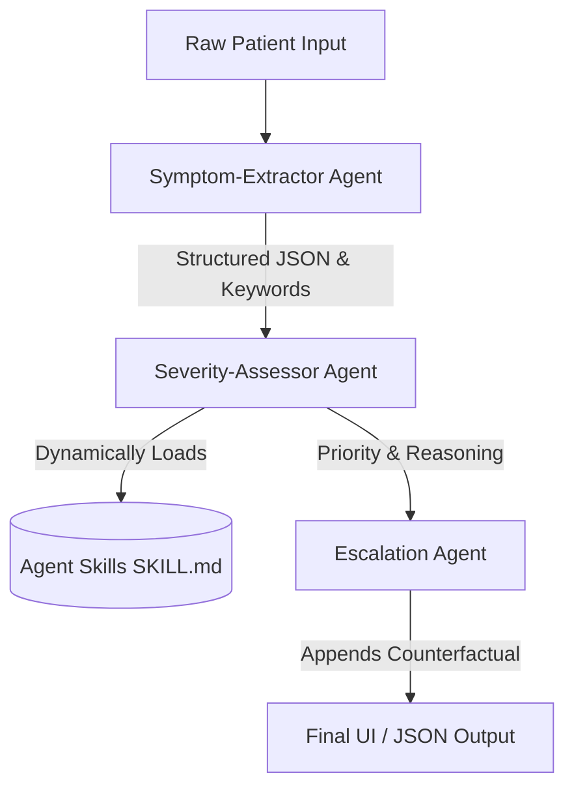

# Acuity - Kaggle 5DGAI Capstone Project

## The Pitch
Acuity is a multi-agent system that reads a patient's free-text symptom description and produces a clinical urgency verdict — not as a black-box label, but with visible reasoning and an explicit statement of what would have changed the answer.

## Architecture
The system relies on an Orchestrator and three independent agents:
1. **Symptom-Extractor Agent**: Converts raw text into structured JSON data without making diagnostic assumptions.
2. **Severity-Assessor Agent**: Evaluates urgency (NORMAL, URGENT, EMERGENCY). It relies on **Agent Skills**, conditionally loading specialized knowledge (e.g., cardiac, respiratory, trauma) from `SKILL.md` files based on the extracted red flag keywords. This prevents context rot by not bloating the LLM prompt with unnecessary data.
3. **Escalation Agent**: Adds a mandatory counterfactual sentence explaining what exact symptom would elevate the urgency, enabling human verification and building "Effective Trust."



### Conditional Skill Loading
The Severity-Assessor agent reads the Extractor's output and matches keywords to condition families. It then reads the corresponding `SKILL.md` files from disk at runtime and dynamically injects them into the Gemini prompt. This ensures the model only receives the relevant clinical guidelines needed for the specific case.

## Setup Instructions
1. Ensure Python 3.9+ is installed.
2. Clone this repository and navigate to the project root.
3. Install dependencies:
   ```bash
   pip install -r requirements.txt
   ```
4. Copy `.env.example` to `.env` and add your Gemini API key:
   ```bash
   cp .env.example .env
   ```
5. Run the web server:
   ```bash
   python app.py
   ```
6. Open your browser and navigate to `http://localhost:8000`.

## Evaluation Results

**Vignette 1 (quiet_danger)**
> **Patient Text:** "My jaw has been aching a bit this morning and my arm feels kind of heavy. I also feel a little sweaty, maybe it's the weather."
> 
> **Expected:** `EMERGENCY` | **Predicted:** `EMERGENCY`
> 
> **Reasoning:** The symptoms 'aching jaw', 'heavy arm', and 'sweaty' align with the 'Cardiac Red Flags' skill rule...
> 
> **Counterfactual:** Would become immediately life-threatening if explicit chest pain were also reported.
> 
> ✅ **Correct:** True | 🚨 **Dangerous Miss:** False

**Vignette 2 (quiet_danger)**
> **Patient Text:** "I'm just really tired and my back hurts between my shoulder blades, plus a little heartburn that won't go away. Just generally feel off."
> 
> **Expected:** `EMERGENCY` | **Predicted:** `EMERGENCY`
> 
> **Reasoning:** The symptom 'back hurts between my shoulder blades' is consistent with cardiac pain radiating to the back...
> 
> **Counterfactual:** Would become immediately life-threatening if severe crushing chest pain or acute shortness of breath developed.
> 
> ✅ **Correct:** True | 🚨 **Dangerous Miss:** False

**Vignette 3 (quiet_danger)**
> **Patient Text:** "My husband hit his head a few hours ago, he said he was fine but now he's sleeping on the couch and I can't really wake him up properly. He just mumbles."
> 
> **Expected:** `EMERGENCY` | **Predicted:** `EMERGENCY`
> 
> **Reasoning:** 'Sleeping on the couch and cannot wake him up' indicates a potential altered mental status following a head injury, triggering the Trauma skill.
> 
> **Counterfactual:** Would become immediately life-threatening if breathing became irregular or he became entirely unresponsive to pain.
> 
> ✅ **Correct:** True | 🚨 **Dangerous Miss:** False

---

### 📊 EVALUATION SUMMARY
* **Total Vignettes:** 13
* **Overall Accuracy:** 100.0%
* **Dangerous Miss Rate:** 0.0%

---

### Full Evaluation Dataset

1. **(quiet_danger)** "My jaw has been aching a bit this morning and my arm feels kind of heavy. I also feel a little sweaty, maybe it's the weather." 
   * *Correct Tier:* `EMERGENCY`
2. **(quiet_danger)** "I'm just really tired and my back hurts between my shoulder blades, plus a little heartburn that won't go away. Just generally feel off." 
   * *Correct Tier:* `EMERGENCY`
3. **(quiet_danger)** "My husband hit his head a few hours ago, he said he was fine but now he's sleeping on the couch and I can't really wake him up properly. He just mumbles." 
   * *Correct Tier:* `EMERGENCY`
4. **(quiet_danger)** "I have a cough but now when I try to talk to you I just can't finish the sentence without stopping to catch my breath." 
   * *Correct Tier:* `EMERGENCY`
5. **(red_herring)** "I am bleeding profusely! I got a paper cut and there is blood everywhere, it looks like a murder scene but it stopped when I held a tissue on it for a minute." 
   * *Correct Tier:* `NORMAL`
6. **(red_herring)** "My chest hurts so much, it's a sharp stabbing pain right in the middle every single time I take a deep breath or twist my body. It goes away when I hold my breath." 
   * *Correct Tier:* `NORMAL`
7. **(red_herring)** "I have a terrifying looking bruise, it's dark purple and black and huge, after I bumped my leg on the coffee table. It doesn't hurt to walk though." 
   * *Correct Tier:* `NORMAL`
8. **(red_herring)** "I'm coughing up so much phlegm, my nose is completely blocked and my head is pounding. I feel like I'm dying from this cold." 
   * *Correct Tier:* `NORMAL`
9. **(clear_cut)** "I am having severe crushing chest pain radiating to my left arm, I am sweating a lot and I threw up twice." 
   * *Correct Tier:* `EMERGENCY`
10. **(clear_cut)** "I slipped on the ice and my ankle is very swollen and turning purple. I cannot walk on it at all." 
   * *Correct Tier:* `URGENT`
11. **(clear_cut)** "I have had a fever of 102 for three days and my lower right stomach really hurts when I press on it." 
   * *Correct Tier:* `URGENT`
12. **(clear_cut)** "I have a mild headache and a runny nose that started two days ago." 
   * *Correct Tier:* `NORMAL`
13. **(clear_cut)** "I scraped my knee on the sidewalk when I tripped. It stings a bit but I washed it out." 
   * *Correct Tier:* `NORMAL`
